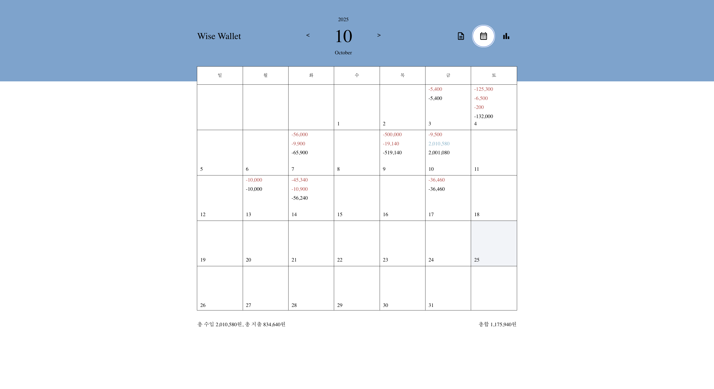

# bye2money

전기정보공학부 김희원 웹가계부 프로젝트

## How to run this project

### Vite Frontend

```bash
# move to the project directory
cd vite-bye2money

# install dependencies if needed
npm install

# run this project
npm run dev
```

This project will open at `http://localhost:5173`

### Express Backend

```bash
# move to the server directory
cd server

# install dependecies if needed
npm install

# run this project
npm run dev
```

This project will open at `http://localhost:3000`

## Project Structure

- `src`
  - `components`
    - `Button`
    - `CategoryTag`
    - `CheckBox`
    - `Modal`
    - `TextInput`
  - `constants`
    - `api.ts`: API port, endpoint, etc are defined here
  - `pages`
    - `ComponentTestPage.tsx`
    - `MainPage.tsx`
  - `styles`
    - `colors.css`: The color system is defined here
  - `types`
    - `types.ts`: All shared types are defined here
  - `ui`
    - `Calendar`
    - `CalendarCaption`
    - `Header`
    - `InputBar`
    - `MonthlyInfo`
    - `PaymentSelectPanel`
    - `RecordList`
  - `utils`
    - `api`: All API call functions are defined here
    - `utils.ts`: All other (shared) utility functions are defined here

* `components` directory contains reusable common components, and `ui` directory contains larger, feature-specific ui components for the main page.

## Color system

Defined at [`colors.css`](/vite-bye2money/src/styles/colors.css)

## Icons

Using Material UI

## Code Convention

- Handler: name starts with `handle`
- Each component directory (total 5) consists of:
  - `<component name>.tsx` : TSX component (Component defined in this file is imported from other files)
  - `<component name>.module.css` : CSS module file
  - `const.ts` : const variables are defined if needed (`/constants` directory로 옮길까 생각중)
- Components are defined using the arrow function:

  ```tsx
  export interface ComponentProps {
  	// FIXME: maybe erase export later
  	prop1: PropType1;
  	prop2: PropType2;
  }

  // maybe some small business logics (large ones are defined explicitly at seperate files)

  const Component = ({ props }: ComponentProps) => {
  	// hooks
  	// maybe some small business logics
  	return <></>;
  };

  export default Component;
  ```

- For CSS files, use the defined color system as much as possible
- Pages are named as: `<Page name>Page.tsx`

## Notes

- 공통 변수는 `MainPage.tsx`에서 관리 (Provider? Maybe replace later)
- `InputBar` component는 global한 `year`, `month`와 연동되지 않도록

## Component Testing

5 common components' UI & features are tested using `/pages/ComponentTestPage.tsx`.

This page can be accessed by: `http://localhost:5173/component-test`

## Checklist (개발 순서)

### 첫 주 (6주차)

- 공통 컴포넌트 5개 개발 완료: `/components-test` 페이지를 만들어, 테스트 진행하였음
- Routing은 `react-dom` 설치하여 구현하였음. Page가 늘어날 것 같지는 않지만, `/pages` directory도 생성함.
- 공통 컴포넌트는 아직 미흡한 부분이 많은데 (props로 넘겨줄 변수들 등), main page UI 생성하면서 다듬을 예정
- UI 컴포넌트 중 Header, Calendar 컴포넌트 생성 완료
  - 현재 선택한 년도/ 날짜, 그리고 선택한 탭 (records/ calendar/ analytics) 모두 global하게 공유하도록: `App.tsx`에서 선언한 변수들을, main page를 이루는 컴포넌트들에 모두 prop으로 넘겨주도록 구현함. Provider까지 사용할 것은 아니라고 생각하였음.
  - Header에서 선택한 년도/날짜가 Calendar에서도 연동되어 작동하도록 구현하였음 (마찬가지로 `App.tsx`에서 props넘겨주는 방식)
- Calendar는 `react-day-picker` 사용하여 UI를 간단히 구현하였고, 날짜 관련 utility 등은 `date-fns`와 ~~약간의 AI의 도움을 받아~~ 구현
- Material UI 사용

### 둘째 주 (7주차)

- Records page 모두 구현 완료
  - InputBar component 구현 완료
  - InputBar의 default 날짜는 오늘 날짜로 설정
  - InputBar에서 표시한 날짜는, 전체 Header의 날짜와 독립적으로 움직이도록 구현 (직관적으로 Header month를 움직이더라도 InputBar의 날짜는 움직이지 않는게 맞다고 생각함)
  - Express server에 data를 `data.js`에 저장 후, GET과 POST API 생성
  - InputBar에서 제출 시(버튼 클릭 시) Frontend에서 1차로 null input/invalid format 없는지 검증 -> Backend에서도 (필요 없지만) 2차로 null input/invalid format 검증
  - RecordPage는 각 record를 관리하는 RecordItem component와, RecordItem component를 mapping해서 구현한 RecordList component로 구현
  - 전체 내역은 MonthlyInfo component를 만들어서 구현
  - 결제수단 선택 panel은 custom하게 PaymentSelectPanel.tsx로 구현
  - PaymentSelectPanel의 위치는 내 노트북 화면에 맞게 hardcoding했는데, 나중에 CSS 수정 필요
- Calendar page 모두 구현 완료
  - 1주차에서 구현해놨는데, 여기서 UI와 기능만 조금 수정하였음
  - CalendarCaption component 사용해서 달의 지출/수입 등 요약
  - Calendar에서 선택된 날짜는 오늘 날짜
- 필요한 Backend API 구현 완료 (Express server 사용) 및 Frontend와 연결 완료
  - Frontend에서 api 연결하는 부분은 `utils/api/`에 구현

## Completed Screen Overview

2025/10/25 스크린샷

### Records


### Calendar


